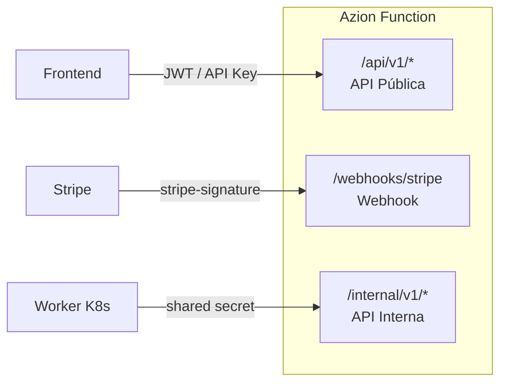
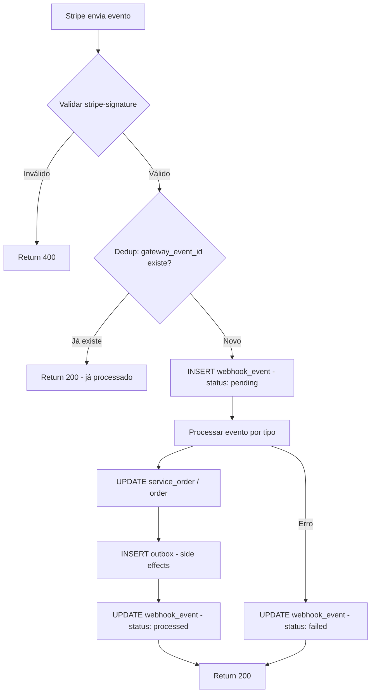
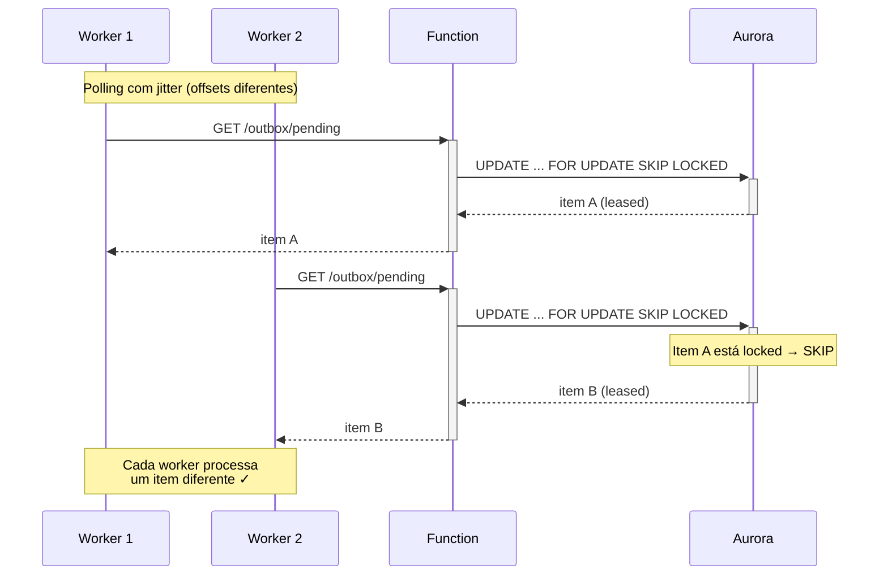

# API Endpoints — Service Order API

**Data:** 2026-03-10

---

## Visão Geral das Superfícies



## API Pública (`/api/v1/*`)

Autenticação: JWT ou API Key do cliente.

| Método | Endpoint | Descrição |
|---|---|---|
| `POST` | `/api/v1/service-orders` | Criar SO (signup hobby ou pago) |
| `GET` | `/api/v1/service-orders/{id}` | Consultar SO |
| `POST` | `/api/v1/service-orders/{id}/upgrade` | Solicitar upgrade |
| `POST` | `/api/v1/service-orders/{id}/downgrade` | Solicitar downgrade |
| `DELETE` | `/api/v1/service-orders/{id}/cancel-downgrade` | Cancelar downgrade agendado |
| `POST` | `/api/v1/service-orders/{id}/cancel` | Cancelar assinatura |

---

## Webhook (`/webhooks/*`)

Autenticação: `stripe-signature` header (HMAC com webhook secret).

| Método | Endpoint | Descrição |
|---|---|---|
| `POST` | `/webhooks/stripe` | Receber eventos da Stripe |

**Eventos processados:**
- `checkout.session.completed` — ativação de SO
- `invoice.payment_succeeded` — confirmação de pagamento
- `invoice.payment_failed` — falha de pagamento → PAST_DUE
- `customer.subscription.updated` — efetivação de downgrade
- `customer.subscription.deleted` — efetivação de cancelamento
- `subscription_schedule.created` — auditoria de agendamento
- `subscription_schedule.released` — execução de downgrade agendado

### Fluxo do Webhook Handler



---

## API Interna (`/internal/v1/*`)

Autenticação: shared secret entre worker e function.

### Outbox

| Método | Endpoint | Descrição |
|---|---|---|
| `GET` | `/internal/v1/outbox/pending` | Buscar 1 item pendente (aplica lease) |
| `POST` | `/internal/v1/outbox/{id}/process` | Executar side effect do item |
| `PATCH` | `/internal/v1/outbox/{id}/complete` | Marcar como completed ou failed |

### Jobs

| Método | Endpoint | Descrição |
|---|---|---|
| `POST` | `/internal/v1/jobs/check-grace-period` | Bloquear contas inadimplentes após 5 dias |

### GET /internal/v1/outbox/pending

Retorna **1 item** por chamada. Aplica lease atomicamente.

**SQL interno:**
```sql
UPDATE outbox
SET status = 'processing',
    locked_until = NOW() + INTERVAL '5 minutes'
WHERE outbox_id = (
    SELECT outbox_id FROM outbox
    WHERE status IN ('pending', 'processing')
      AND (locked_until IS NULL OR locked_until < NOW())
      AND retry_count < max_retries
    ORDER BY created_at
    LIMIT 1
    FOR UPDATE SKIP LOCKED
)
RETURNING *;
```

**Response 200 (item encontrado):**
```json
{
  "outbox_id": "uuid",
  "event_type": "provision_plan",
  "aggregate_type": "service_order",
  "aggregate_id": "uuid",
  "payload": { "account_id": 123, "plan_id": "uuid", "action": "activate" },
  "retry_count": 0
}
```

**Response 204:** Nenhum item pendente.

### POST /internal/v1/outbox/{id}/process

Executa o side effect baseado no `event_type` do item:
- `provision_plan` → Product API: `POST /provision`
- `deprovision_plan` → Product API: `POST /provision/downgrade`
- `notify_user` → serviço de notificação

**Response 200:** Side effect executado com sucesso.
**Response 500:** Falha na execução (worker deve chamar complete com status=failed).

### PATCH /internal/v1/outbox/{id}/complete

**Request:**
```json
{
  "status": "completed",
  "error_message": null
}
```

**Comportamento:**
- `completed`: marca `processed_at = NOW()`, limpa `locked_until`
- `failed`: incrementa `retry_count`, limpa `locked_until` (fica disponível pro próximo ciclo), salva `error_message`

---

## Distribuição de Carga do Worker

### Fluxo de Aquisição de Item



### Soluções implementadas

| Problema | Solução |
|---|---|
| Burst simultâneo | Jitter aleatório no intervalo de polling |
| Dois workers pegam mesmo item | `FOR UPDATE SKIP LOCKED` |
| Worker morre com item | Lease expira em 5min |
| Item falha eternamente | `retry_count < max_retries` + monitoração |

---

## Formato de Resposta

**Sucesso:**
```json
{
  "data": { ... }
}
```

**Erro:**
```json
{
  "error": "invalid_upgrade",
  "message": "Selected plan is not an upgrade",
  "details": { "current_sort_order": 20, "new_sort_order": 10 }
}
```
