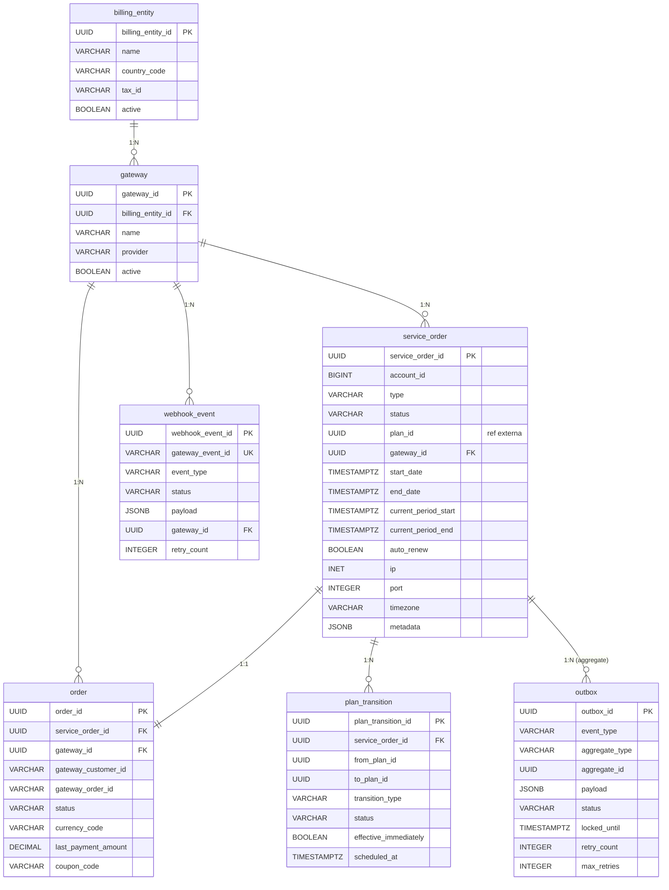
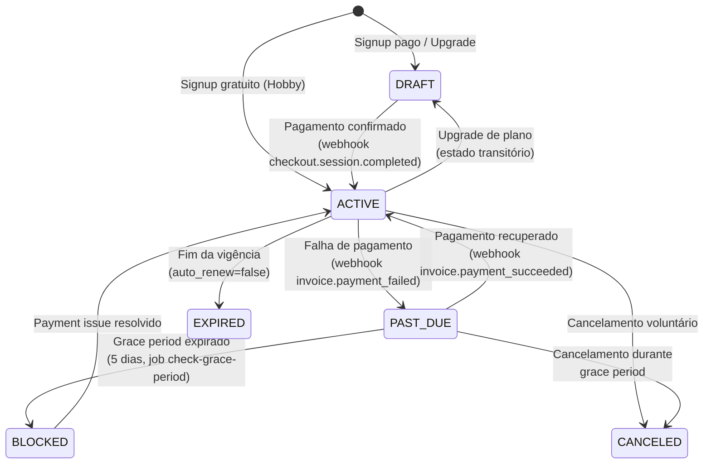
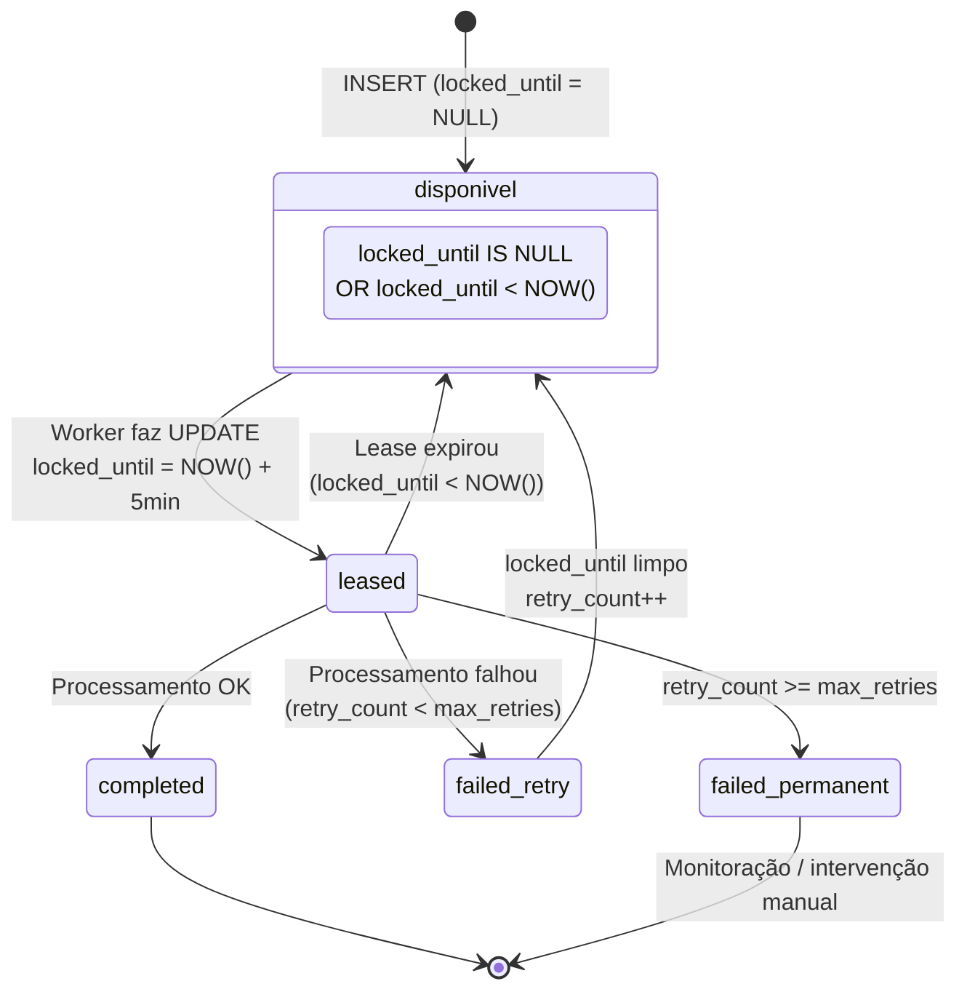

# Modelo de Dados — Service Order API

**Data:** 2026-03-10

---

## Diagrama ER



## Estado da Service Order



## Tabelas Core

### service_order — Contrato digital (domínio Azion)

```sql
CREATE TABLE service_order (
    service_order_id     UUID PRIMARY KEY DEFAULT gen_random_uuid(),
    account_id           BIGINT NOT NULL,
    type                 VARCHAR(50) NOT NULL,   -- 'plan_subscription'
    status               VARCHAR(20) NOT NULL,   -- DRAFT, ACTIVE, PAST_DUE, BLOCKED, CANCELED, EXPIRED
    plan_id              UUID NOT NULL,           -- ref externa (Product API)
    gateway_id           UUID REFERENCES gateway(gateway_id),
    start_date           TIMESTAMPTZ,
    end_date             TIMESTAMPTZ,
    current_period_start TIMESTAMPTZ,
    current_period_end   TIMESTAMPTZ,
    auto_renew           BOOLEAN DEFAULT true,
    -- Auditoria (Marco Civil da Internet)
    ip                   INET NOT NULL,
    port                 INTEGER NOT NULL,
    ip_fwd               INET,
    port_fwd             INTEGER,
    timezone             VARCHAR(50) NOT NULL,
    -- Metadata (dados fiscais em JSONB: tax_id, legal_name, billing_address, etc.)
    metadata             JSONB DEFAULT '{}',
    -- Timestamps
    created_at           TIMESTAMPTZ NOT NULL DEFAULT NOW(),
    updated_at           TIMESTAMPTZ NOT NULL DEFAULT NOW(),
    last_editor          VARCHAR(100)
);
```

---

### order — Espelho da Stripe

```sql
CREATE TABLE "order" (
    order_id             UUID PRIMARY KEY DEFAULT gen_random_uuid(),
    service_order_id     UUID NOT NULL REFERENCES service_order(service_order_id),
    gateway_id           UUID NOT NULL REFERENCES gateway(gateway_id),
    gateway_customer_id  VARCHAR(100),    -- stripe customer_id
    gateway_order_id     VARCHAR(100),    -- stripe subscription_id
    status               VARCHAR(20),
    currency_code        VARCHAR(3),
    next_payment_date    TIMESTAMPTZ,
    last_payment_date    TIMESTAMPTZ,
    last_payment_amount  DECIMAL(12,2),
    -- Cupom
    coupon_code          VARCHAR(100),
    stripe_coupon_id     VARCHAR(100),
    discount_type        VARCHAR(20),
    discount_value       DECIMAL(12,2),
    discount_applied     DECIMAL(12,2),
    -- Timestamps
    created_at           TIMESTAMPTZ NOT NULL DEFAULT NOW(),
    updated_at           TIMESTAMPTZ NOT NULL DEFAULT NOW()
);
```

---

### webhook_event — Dedup e auditoria de webhooks

```sql
CREATE TABLE webhook_event (
    webhook_event_id     UUID PRIMARY KEY DEFAULT gen_random_uuid(),
    gateway_event_id     VARCHAR(100) UNIQUE NOT NULL,  -- stripe event_id (dedup key)
    event_type           VARCHAR(100) NOT NULL,
    status               VARCHAR(20) NOT NULL,          -- pending, processing, processed, failed
    payload              JSONB NOT NULL,
    gateway_id           UUID REFERENCES gateway(gateway_id),
    error_message        TEXT,
    retry_count          INTEGER DEFAULT 0,
    received_at          TIMESTAMPTZ NOT NULL DEFAULT NOW(),
    processed_at         TIMESTAMPTZ
);
```

---

### outbox — Side effects pendentes

```sql
CREATE TABLE outbox (
    outbox_id            UUID PRIMARY KEY DEFAULT gen_random_uuid(),
    event_type           VARCHAR(100) NOT NULL,    -- 'provision_plan', 'deprovision_plan', 'notify_user'
    aggregate_type       VARCHAR(100) NOT NULL,    -- 'service_order'
    aggregate_id         UUID NOT NULL,            -- service_order_id
    payload              JSONB NOT NULL,
    status               VARCHAR(20) NOT NULL DEFAULT 'pending',  -- pending, processing, completed, failed
    locked_until         TIMESTAMPTZ,              -- lease (null = disponível)
    retry_count          INTEGER DEFAULT 0,
    max_retries          INTEGER DEFAULT 5,
    error_message        TEXT,
    created_at           TIMESTAMPTZ NOT NULL DEFAULT NOW(),
    processed_at         TIMESTAMPTZ
);
```

### Lease do Outbox



---

### plan_transition — Auditoria de mudanças de plano

```sql
CREATE TABLE plan_transition (
    plan_transition_id   UUID PRIMARY KEY DEFAULT gen_random_uuid(),
    service_order_id     UUID NOT NULL REFERENCES service_order(service_order_id),
    from_plan_id         UUID,                    -- null no signup
    to_plan_id           UUID NOT NULL,
    transition_type      VARCHAR(20) NOT NULL,    -- signup, upgrade, downgrade
    status               VARCHAR(20) NOT NULL,    -- pending, completed, failed, canceled
    effective_immediately BOOLEAN NOT NULL,
    prorated             BOOLEAN DEFAULT false,
    scheduled_at         TIMESTAMPTZ,             -- para downgrades agendados
    started_at           TIMESTAMPTZ,
    completed_at         TIMESTAMPTZ,
    error_message        TEXT,
    created_at           TIMESTAMPTZ NOT NULL DEFAULT NOW(),
    last_editor          VARCHAR(100)
);
```

---

### billing_entity — Entidades cobradoras

```sql
CREATE TABLE billing_entity (
    billing_entity_id    UUID PRIMARY KEY DEFAULT gen_random_uuid(),
    name                 VARCHAR(100) NOT NULL,   -- 'Azion Technologies LLC'
    country_code         VARCHAR(2) NOT NULL,
    tax_id               VARCHAR(50),
    active               BOOLEAN DEFAULT true,
    created_at           TIMESTAMPTZ NOT NULL DEFAULT NOW()
);
```

---

### gateway — Config de gateways de pagamento

```sql
CREATE TABLE gateway (
    gateway_id           UUID PRIMARY KEY DEFAULT gen_random_uuid(),
    billing_entity_id    UUID NOT NULL REFERENCES billing_entity(billing_entity_id),
    name                 VARCHAR(50) NOT NULL,    -- 'stripe'
    provider             VARCHAR(50) NOT NULL,    -- 'stripe'
    active               BOOLEAN DEFAULT true,
    created_at           TIMESTAMPTZ NOT NULL DEFAULT NOW()
);
```

---

## Índices

```sql
-- Outbox: itens disponíveis para o worker
CREATE INDEX idx_outbox_pending ON outbox (created_at)
    WHERE status IN ('pending', 'processing')
    AND (locked_until IS NULL OR locked_until < NOW());

-- Service Order ativa por account (unicidade por tipo)
CREATE UNIQUE INDEX idx_so_active_plan ON service_order (account_id, type)
    WHERE status IN ('DRAFT', 'ACTIVE', 'PAST_DUE');

-- Order por gateway_order_id (busca por subscription_id)
CREATE INDEX idx_order_gateway_order ON "order" (gateway_order_id);

-- Webhook event por tipo e status (processamento)
CREATE INDEX idx_webhook_event_status ON webhook_event (status, received_at)
    WHERE status IN ('pending', 'processing');

-- Plan transition por service_order (histórico)
CREATE INDEX idx_plan_transition_so ON plan_transition (service_order_id, created_at);
```

## Observações

1. **Sem tabela `customers` separada** — `gateway_customer_id` fica na tabela `order`
2. **Dados fiscais em JSONB** — `tax_id`, `legal_name`, `billing_address` ficam em `service_order.metadata` (obrigatórios apenas para planos pagos)
3. **`plan_id` é referência externa** — vem da Product API, não é FK no banco
4. **`billing_entity` e `gateway`** — 1 registro cada por enquanto, schema preparado para múltiplos
5. **Tabela `order` usa aspas** — `"order"` é palavra reservada no PostgreSQL
