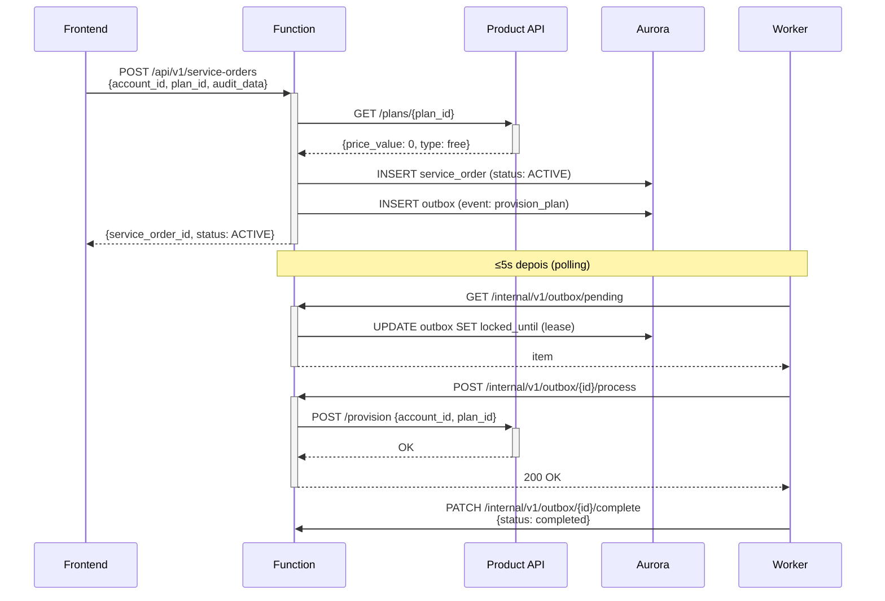
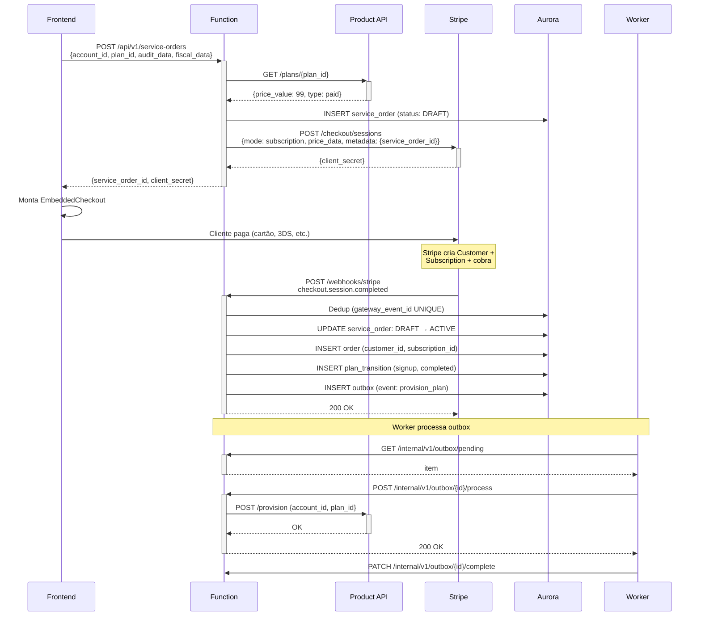
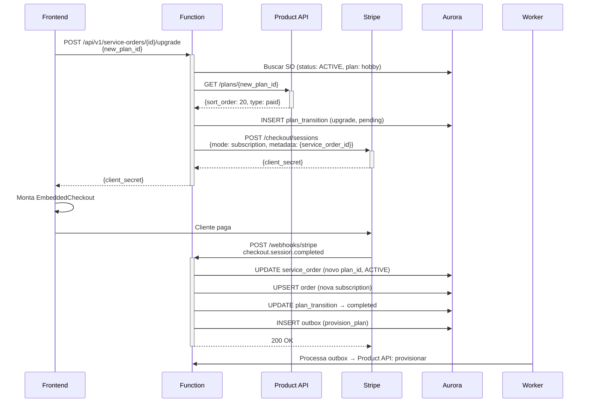
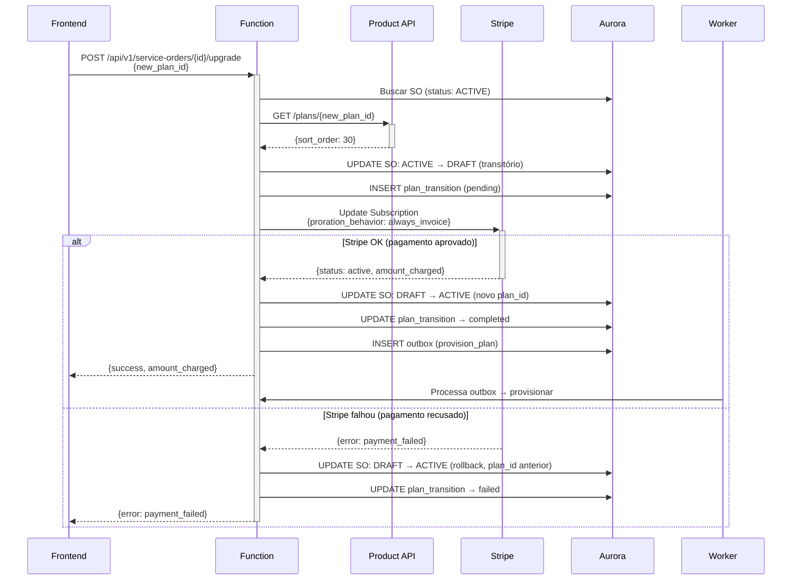
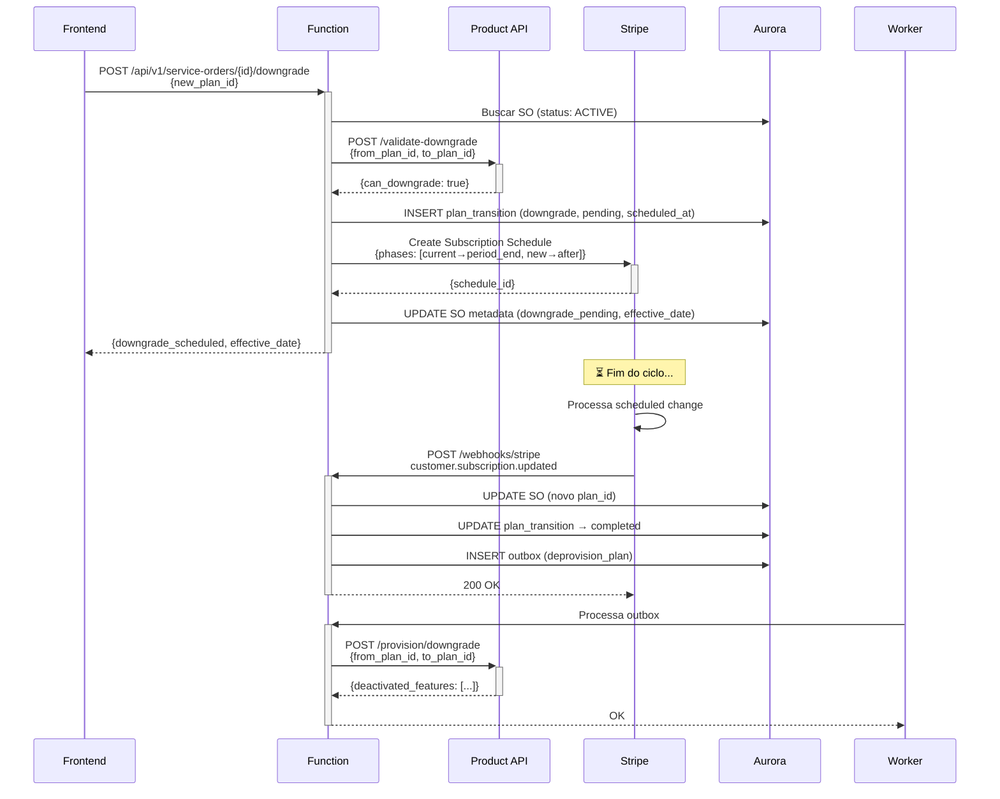
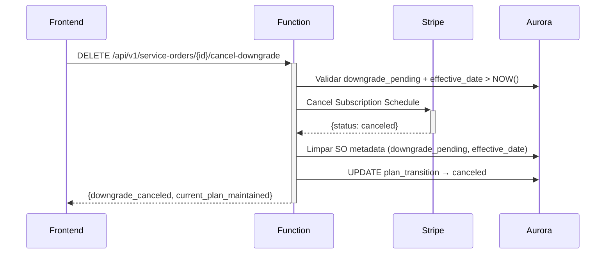
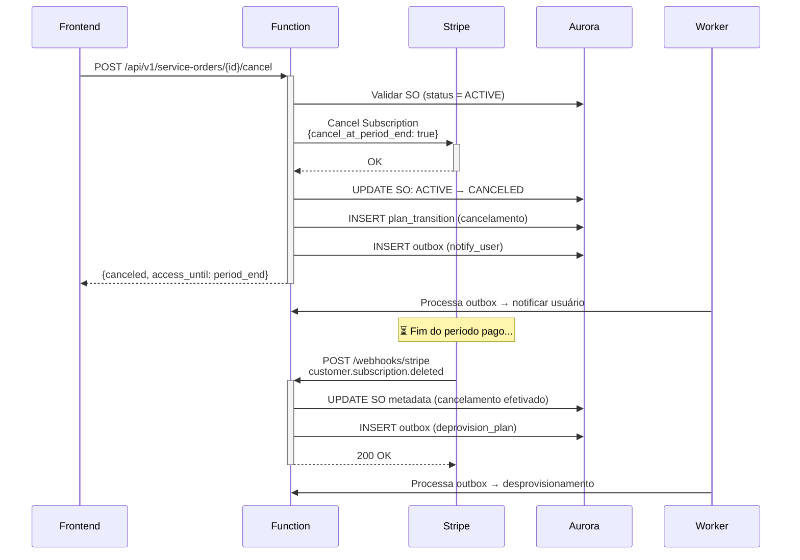
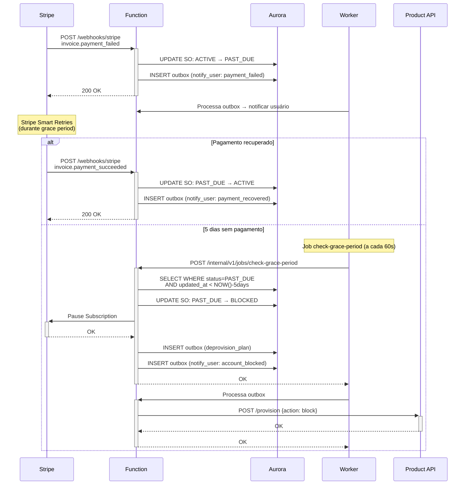
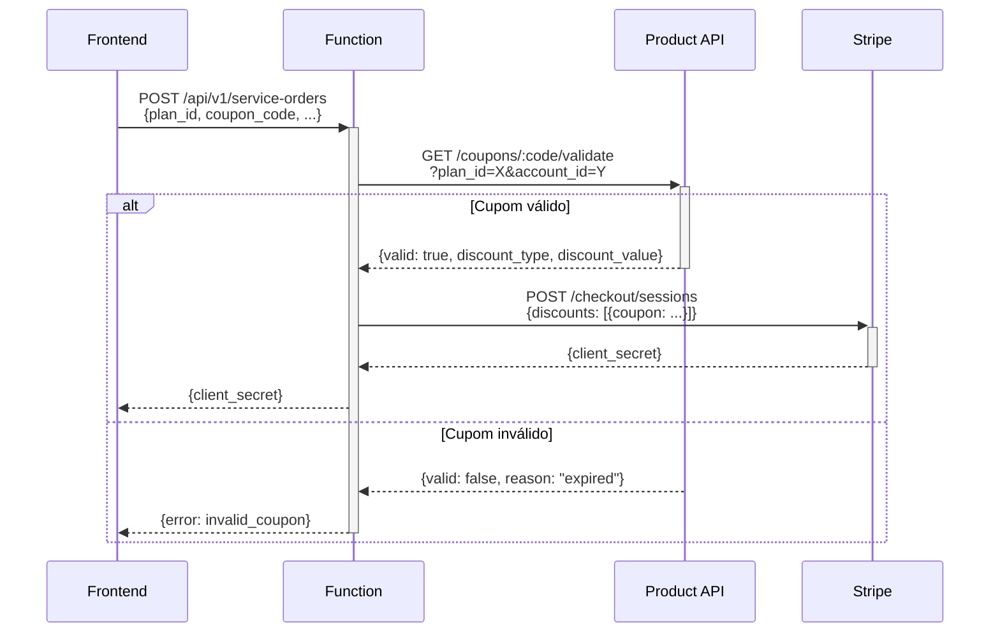

# Fluxos Detalhados — Service Order API

**Data:** 2026-03-10

---

## Regra Geral

- **Síncrono no request**: interação com Stripe, validação via Product API, persistência no DB
- **Assíncrono via outbox → worker**: provisionamento, desprovisionamento, notificações

---

## 1. Signup — Plano Gratuito (Hobby)

**Regras:**
- Campos de auditoria (ip, port, timezone) sempre obrigatórios
- Dados fiscais NÃO obrigatórios para plano gratuito
- Sem integração com Stripe
- `gateway_id`, `order` não são criados

---

## 2. Signup — Plano Pago (via Embedded Checkout)

**Regras:**
- Dados fiscais obrigatórios (tax_id, legal_name, billing_address)
- Checkout Session criada com `mode: 'subscription'`
- `metadata` da session contém `service_order_id` para correlação no webhook
- Stripe cria Customer + Subscription + cobra automaticamente
- Webhook `checkout.session.completed` é o trigger para ativação
- Idempotência via `gateway_event_id` (UNIQUE)

---

## 3. Upgrade Hobby → Pago (via Embedded Checkout)

**Regras:**
- Cliente Hobby não tem customer/subscription na Stripe → precisa de Embedded Checkout
- Mesmo fluxo do signup pago, mas SO já existe
- Plan transition registra `from_plan_id` (hobby) e `to_plan_id` (novo)

---

## 4. Upgrade Pago → Pago (API server-side)

**Regras:**
- Cliente já tem customer + subscription + payment method na Stripe
- Stripe calcula proration automaticamente
- `billing_cycle_anchor: 'unchanged'` — ciclo de cobrança não muda
- Se pagamento falhar: rollback automático para plano anterior
- Durante DRAFT transitório: usuário mantém acesso ao plano anterior

---

## 5. Downgrade (agendado para fim do ciclo)

**Regras:**
- `new_plan.sort_order < current_plan.sort_order`
- Sem reembolso — acesso ao plano atual até fim do período
- Subscription Schedule com 2 fases: plano atual até `period_end`, plano novo depois
- Cancelamento do downgrade permitido antes da efetivação
- Product API valida se cliente pode fazer downgrade (features em uso)

---

## 6. Cancelamento de Downgrade

---

## 7. Cancelamento Voluntário

**Regras:**
- Acesso mantido até fim do período pago
- Sem reembolso
- `cancel_at_period_end: true` — Stripe cancela no fim do ciclo
- Webhook `customer.subscription.deleted` confirma efetivação

---

## 8. Inadimplência e Grace Period

**Regras:**
- Grace period: 5 dias corridos a partir da mudança para PAST_DUE
- Stripe tenta cobrança automaticamente durante o período (Smart Retries)
- Se pagamento recuperado: volta pra ACTIVE automaticamente (via webhook)
- Se expirar: worker bloqueia conta
- Subscription pausada (não cancelada) — preserva histórico para reativação
- Reativação disponível após resolver payment issue

---

## 9. Webhooks Processados

| Webhook | Ação |
|---|---|
| `checkout.session.completed` | SO: DRAFT → ACTIVE, criar order, outbox → provisionar |
| `invoice.payment_succeeded` | Confirmar pagamento, SO → ACTIVE se PAST_DUE |
| `invoice.payment_failed` | SO: ACTIVE → PAST_DUE, outbox → notificar |
| `customer.subscription.updated` | Atualizar order, efetivar downgrade agendado |
| `customer.subscription.deleted` | Efetivar cancelamento, outbox → desprovisionamento |
| `subscription_schedule.created` | Auditoria — confirmar agendamento |
| `subscription_schedule.released` | Confirmar execução de downgrade agendado |

---

## 10. Aplicação de Cupom

**Regras:**
- Validação de cupom é responsabilidade da Product API
- Cupom aplicado na Checkout Session (Stripe renderiza desconto)
- Dados do cupom armazenados na order (coupon_code, discount_type, discount_value)
- Cupons mantidos durante upgrades Pago→Pago (Stripe preserva automaticamente)
