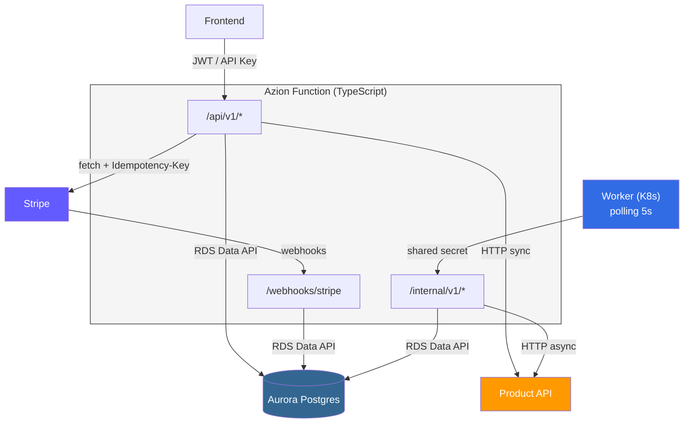
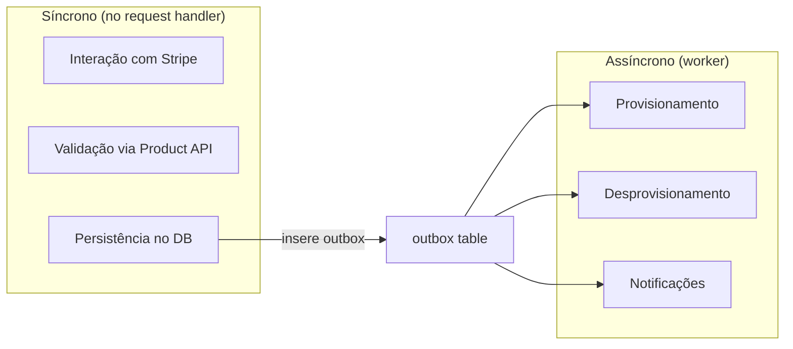
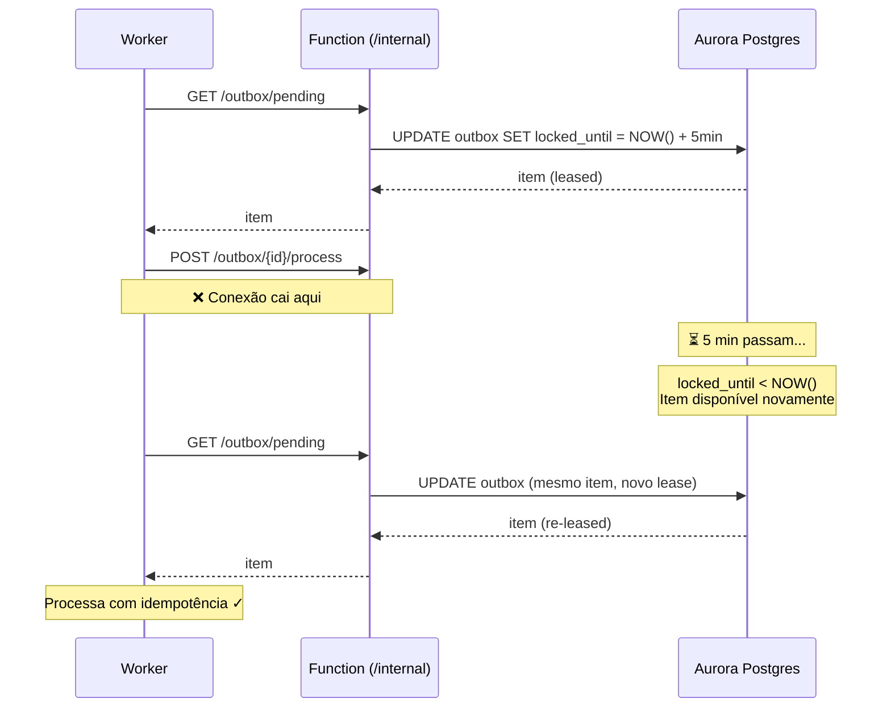

# Arquitetura de Alto Nível — Service Order API

**Data:** 2026-03-10

---

## Visão Geral

Sistema de gestão de assinaturas e pagamentos via Stripe, implementado como uma única Azion Function (TypeScript) com Aurora Postgres (via RDS Data API) e um worker no K8s para processamento de side effects.

## Componentes

### Azion Function (TypeScript)

Uma function com routing por path — 3 superfícies, mesmo deploy:

- **`/api/v1/*`** — API pública, autenticada por JWT ou API Key. Endpoints para o frontend: signup, upgrade, downgrade, cancelamento.
- **`/webhooks/stripe`** — Recepção de webhooks. Sem auth convencional, validada por `stripe-signature` header (HMAC). Só a Stripe chama.
- **`/internal/v1/*`** — API privada, autenticada por shared secret. O worker chama para processar itens do outbox.

### Aurora Postgres (RDS Data API)

- Acesso **exclusivo** pela Azion Function — nenhum outro componente fala direto com o banco
- Keepalive nas connections HTTP da function
- Transações via `BeginTransaction` / `CommitTransaction` com `transactionId`

### Worker (K8s Deployment)

- Deployment com loop contínuo, polling a cada 5s
- Comunica **apenas** com a Azion Function via `/internal/v1/*`
- Nunca acessa o banco diretamente
- Responsável por processar side effects do outbox (provisionamento, notificações, etc.)

### Stripe

- Chamadas síncronas via `fetch` com `Idempotency-Key` em todo POST
- Embedded Checkout para primeiro pagamento (signup e upgrade Hobby→Pago)
- API server-side para upgrade Pago→Pago, downgrade, cancelamento
- Webhooks como fonte de verdade para estado financeiro

### Product API (Sistema Externo)

- Já existente, interface definida
- Chamada síncrona para validação (planos, cupons, pricing)
- Chamada assíncrona (via worker/outbox) para provisionamento e desprovisionamento

## Regra Geral de Sincronismo

## Outbox — Mecanismo Anti-Deadlock

Lease baseado em timestamp em vez de locks de transação:

- Campo `locked_until: TIMESTAMPTZ` na tabela outbox
- Worker faz `UPDATE ... WHERE locked_until IS NULL OR locked_until < NOW()` para adquirir itens
- Lease de 5 minutos — se o worker morrer, o item expira e fica disponível automaticamente
- Side effects devem ser **idempotentes** para tolerar reprocessamento seguro

### Cenário de falha principal (worker perde conexão)

## Fluxos por Feature

| Fluxo | Síncrono (no request) | Assíncrono (worker/outbox) |
|---|---|---|
| Signup Hobby | Cria SO ACTIVE | Provisionar plano |
| Signup Pago | Cria SO DRAFT + Checkout Session | Webhook → provisionar |
| Upgrade Hobby→Pago | Cria Checkout Session | Webhook → provisionar |
| Upgrade Pago→Pago | Chama Stripe (proration) + atualiza DB | Provisionar novo plano |
| Downgrade | Chama Stripe (schedule) + atualiza DB | Desprovisionamento no fim do ciclo |
| Cancelamento | Chama Stripe (cancel) + atualiza DB | Desprovisionamento no fim do período |
| Webhooks | Dedup + atualiza DB + outbox | Side effects |

## Decisões Arquiteturais

1. **Embedded Checkout** em vez de Elements — simplicidade, Stripe cuida de 3DS/PCI, checkout acontece uma vez só
2. **Uma function, 3 superfícies** — acesso centralizado ao banco, deploy único
3. **Worker via HTTP** — não acessa DB direto, mantém invariante de acesso único
4. **Lease-based outbox** — expiração automática, sem deadlock
5. **`FOR UPDATE SKIP LOCKED`** — distribuição entre workers sem duplicidade
6. **Service Order + Order separados** — flexibilidade para multi-gateway futuro
7. **Uma billing entity** — schema preparado para múltiplas, implementação com uma só
8. **Upgrade Hobby→Pago via Embedded Checkout** — primeiro pagamento sempre pelo checkout
9. **Upgrade Pago→Pago com rollback** — se proration falhar, volta pro plano anterior
