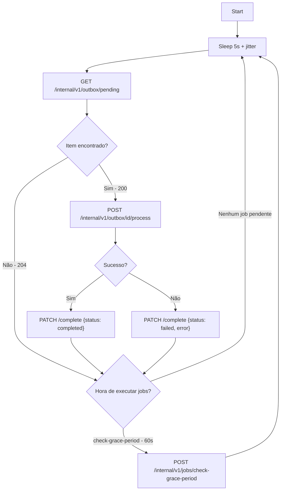
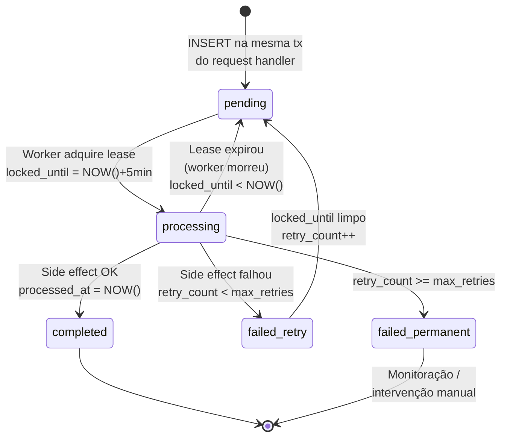
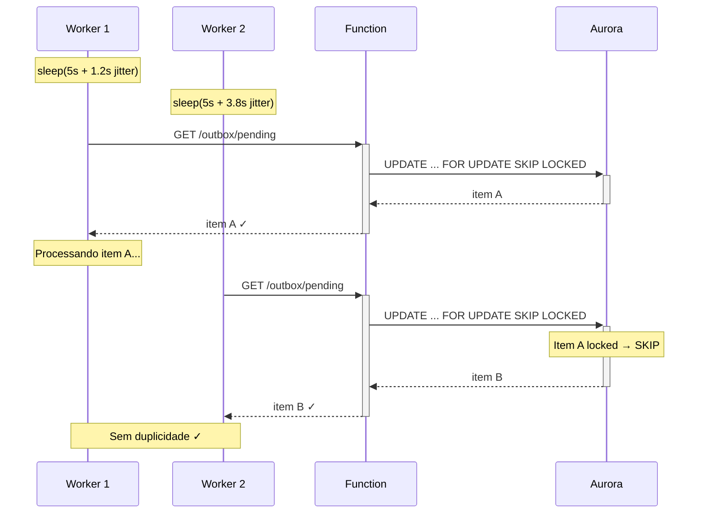
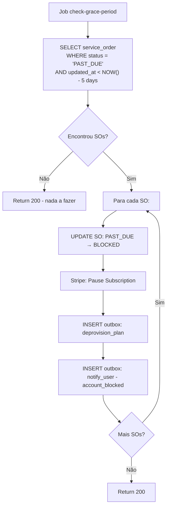

# Worker e Outbox — Service Order API

**Data:** 2026-03-10

---

## Worker (K8s Deployment)

O worker é um Deployment no K8s com lógica simples. Não acessa o banco diretamente — comunica apenas com a Azion Function via `/internal/v1/*`.

### Loop Principal



### Dois Tipos de Chamada Interna

| Tipo | Path | Descrição |
|---|---|---|
| **Outbox** | `/internal/v1/outbox/*` | Processar side effects pendentes (polling 5s) |
| **Jobs** | `/internal/v1/jobs/{job_name}` | Tarefas periódicas autocontidas (intervalo por job) |

Essa separação permite segregar responsabilidades no futuro (workers dedicados por tipo).

---

## Outbox

### Comportamento de Retry

| Campo | Valor |
|---|---|
| `max_retries` | 5 (default) |
| Lease duration | 5 minutos |
| Polling interval | 5s + jitter (0-5s) |
| Retry imediato? | Não — item fica disponível no próximo ciclo após falha |

### Ciclo de Vida de um Item



### Mecanismo Anti-Deadlock (Lease)

- `locked_until = NULL` → item disponível
- `locked_until > NOW()` → item em processamento (leased por um worker)
- `locked_until < NOW()` → lease expirado, item disponível novamente

Se o worker morrer durante o processamento, o lease expira sozinho em 5 minutos. Nenhuma intervenção manual necessária.

### Distribuição entre Múltiplas Réplicas



| Problema | Solução |
|---|---|
| Burst simultâneo | Jitter aleatório (0-5s) no intervalo de polling |
| Dois workers pegam mesmo item | `FOR UPDATE SKIP LOCKED` no SQL |
| Worker morre com item | Lease expira em 5min |
| Item falha eternamente | `retry_count < max_retries` + monitoração/alerta |

### SQL de Aquisição (1 item por ciclo)

```sql
UPDATE outbox
SET status = 'processing',
    locked_until = NOW() + INTERVAL '5 minutes'
WHERE outbox_id = (
    SELECT outbox_id FROM outbox
    WHERE status IN ('pending', 'processing')
      AND (locked_until IS NULL OR locked_until < NOW())
      AND retry_count < max_retries
    ORDER BY created_at
    LIMIT 1
    FOR UPDATE SKIP LOCKED
)
RETURNING *;
```

### Tipos de Evento no Outbox

| event_type | Ação | Chamada externa |
|---|---|---|
| `provision_plan` | Ativar features do plano | Product API: `POST /provision` |
| `deprovision_plan` | Desativar features | Product API: `POST /provision/downgrade` |
| `notify_user` | Enviar notificação | Serviço de notificação |

### Idempotência dos Side Effects

Todos os side effects **devem ser idempotentes**. Se o worker reprocessar um item (por lease expirado ou retry), o resultado deve ser o mesmo.

- `provision_plan`: Product API ignora se já provisionado
- `deprovision_plan`: Product API ignora se já desprovisionado
- `notify_user`: dedup por event_type + aggregate_id + created_at

---

## Jobs Periódicos

### POST /internal/v1/jobs/check-grace-period

**Intervalo:** a cada 60s



**Ações para cada SO encontrada:**
1. Atualiza SO: `PAST_DUE → BLOCKED`
2. Chama Stripe: Pause Subscription
3. Insere outbox: `deprovision_plan`
4. Insere outbox: `notify_user` (account_blocked)

### Jobs Futuros (previstos)

| Job | Intervalo | Descrição |
|---|---|---|
| `check-grace-period` | 60s | Bloquear contas inadimplentes após 5 dias |
| `reconciliation` | 24h | Comparar estado Stripe vs DB |
| `cleanup-outbox` | 24h | Limpar itens completed com mais de 30 dias |
| `cleanup-webhooks` | 24h | Limpar webhook_events processados antigos |
